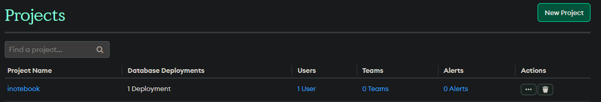
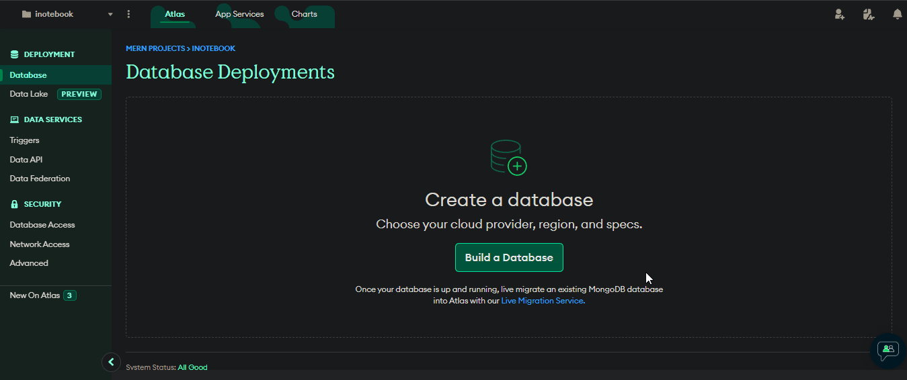

<h1 align=center>iNoteBook</h1>

<h1 align=center> How to Contribute 🤔 </h1>

You can contribute by adding new Web Projects, improving current projects or Documentation. We are also accepting resources which might help new developer upskill their developer Skills. Here are some Instructions before making a Pull Request

## Here are the steps to Make contribute 👣

> IMPORTANT **Note**
>
> **Pull Requests having no issue associated with them will not be accepted. Firstly get an issue assigned, whether it's already opened or raised by you, and then create a Pull Request.**

## Getting started

- Fork this repository (Click the Fork button in the top right of this page, click your Profile Image)
- Clone your fork down to your local machine

```markdown
git clone https://github.com/Aryan-kumar-mains/iNotebook-MernProject.git
```

- Create a branch

```markdown
git checkout -b branch-name
```

- Make your changes (choose from any task below)
- Commit and push

```markdown
git add .
git commit -m 'Commit message'
git push origin branch-name
```

- Create a new pull request from your forked repository (Click the `New Pull Request` button located at the top of your repo)
- Wait for your PR review and merge approval!
- **Star this repository** if you had fun!

---

## Setup Project

1. Install node modules for both client and server

```javascript
npm run install-modules
```

2. Create Mongo DB and Update configurations

- Login to https://account.mongodb.com/account/login
- Create a new project or open an existing project

<p align="center">
  
</p>

- Create a new cluster (Shared Clusters are free) and set configurations



3. Create a file named .env in the root directory and add the following code

```
PORT=5000
DATABASE=<cluster-connection-string>
DATABASE_PASSWORD=<cluster-password>
JWT_SECRET=testsecret
```

Replace the **cluster-connection-string** and **cluster-password** with your connection string and password.

You can access the connection string by pressing on **Connect** -> **Connect your application** on your cluster

4. Run both client and server

```javascript
npm run start-all:dev
```

<hr/>

There is also an option for setting up the project via Docker. To get started with the project by using Docker follow the following steps.

1. Build the docker services

```markdown
docker compose build --no-cache
```

2. Start the services

```markdown
docker-compose up
```

3. To stop the services

```markdown
docker-compose down
```

If you add new node module to your project you have to restart the image using

```markdown
docker-compose up
```
